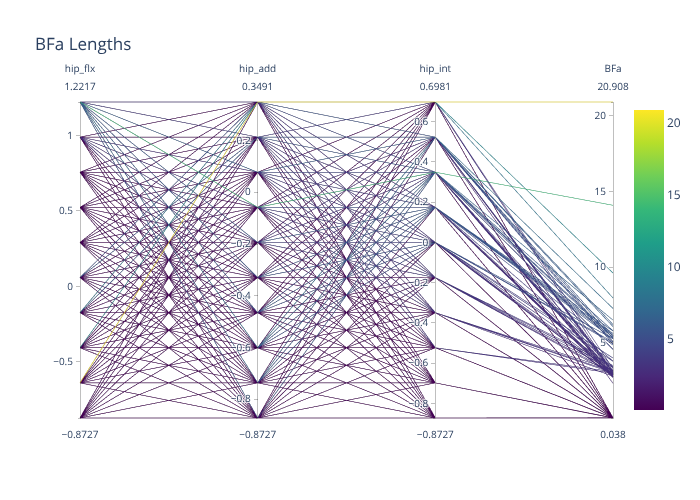
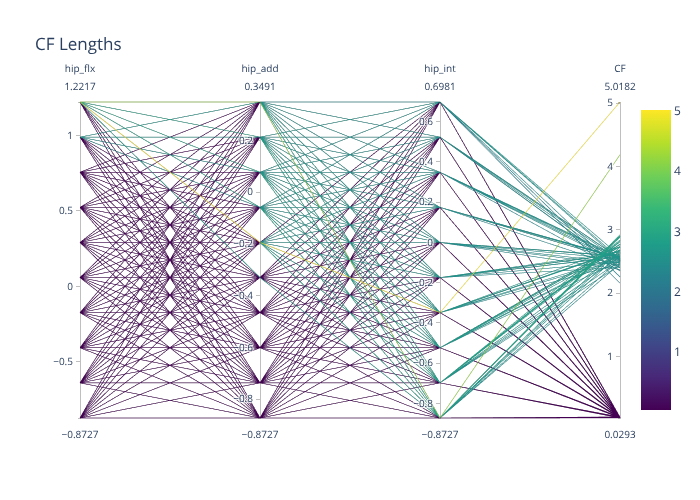
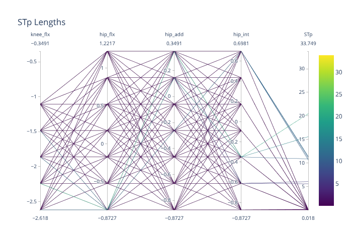
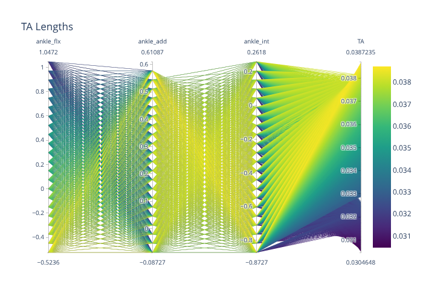
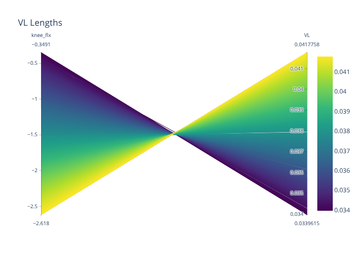
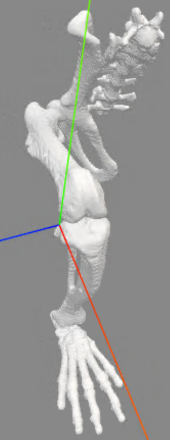

Original model drawn from https://simtk.org/projects/rat_hlimb_model 

```{python}
import pyopensim as osim

model = osim.Model('./models/osim/rat_hindlimb.osim')
```

## Conversion to Millard muscles
The original model uses Thelen muscle models, which have been largely superseded by Millard muscle models in OpenSim. We can convert the muscles using the [`model_thelen_to_millard`](src/rathindlimb/muscle_utils.py) function. 
```{python} 
from rathindlimb import model_thelen_to_millard

millard_model = model_thelen_to_millard(model)
millard_model.printToXML('./models/osim/rat_hindlimb_millard.osim')
```

## Muscle path analysis
The model is moved through its full range of motion and muscle lengths are analyzed to identify discontinuties that may indicate problems with muscle path definitions. The `OsimGraph` class from `movedb` is used to represent an OpenSim model as a graph structure, which allows for efficient analysis of muscle paths.
```{python}
from movedb import OsimGraph

graph = OsimGraph(millard_model)
graph.analyze_muscle_lengths()
```

The muscle lengths are plotted on parallel coordinate plots with the joint angles that influence them. This allows for visual identification of muscles with discontinuous length changes.

```{python}
import plotly.graph_objects as go
import os
figure_dir = './figs'
# TODO
```

### Discontinuous muscles
The following muscles were identified as having discontinuous length changes:

- BFa 

- CF

- STp

- TA

- VL


Investigating the root cause of this, we found that the likely culprit is a hard-coded value in [OpenSim's WrapCylinder.cpp code](https://github.com/opensim-org/opensim-core/blob/f9cd558ec3ea99dda206e5e412e62e23cf19bd7e/OpenSim/Simulation/Wrap/WrapCylinder.cpp#L668) that determines the number of segments used to approximate the muscle path over a wrapping cylinder:

```c
// Each muscle segment on the surface of the cylinder should be
// 0.002 meters long. This assumes the model is in meters, of course.
int numWrapSegments = (int)(aWrapResult.wrap_path_length / 0.002);
if (numWrapSegments < 1) numWrapSegments = 1;
```

This means that for cylinders with small circumferences, the muscle path may be approximated with very few segments, leading to abrupt changes in path length as the muscle wraps around the cylinder. To address this issue, we either need to modify the OpenSim source code to increase the number of segments used for wrapping or modify the wrapping paths in the model. 

Johnson's original model relied heavily on wrapping surfaces, but a more recent work that built upon that original model and drew from Greene's original anatomical text defined a large set of attachment points for muscles instead of relying on wrapping surfaces. This newer model may avoid some of the issues with discontinuous muscle lengths. Unfortunately, that model was created for a software called [Animatlab](https://www.animatlab.com/), and there was no existing OpenSim version of it. 

We were able to get in touch with the author of the Animatlab model, Dr. Young who provided the original files and assisted in understanding the model structure. From there, we manually recorded the muscle attachment points seen in the model as seen in @tbl-young-attachments.

```{python}
#| label: tbl-young-attachments

from IPython.display import Markdown as md
from tabulate import tabulate
import polars as pl

data = pl.read_csv('./data/attachments/young_model_attachments.csv')

md(tabulate(data, headers='keys', tablefmt='pipe'))
```

The coordinate systems used in Animatlab differ from those in OpenSim, so a direct conversion is non-trivial. To be able to transfer the attachment points into our OpenSim model we needed to determine the necessary transformations between the coordinate systems. 
The method we chose to do this was using mesh registration to align the bone geometries from the Animatlab model to those in our OpenSim model. Once aligned, we could apply the same transformations to the muscle attachment points to bring them into the OpenSim coordinate system. 

We utilize the [`open3d`](http://www.open3d.org/) library to perform the mesh registration based on feature computation and the iterative closest point (ICP) algorithm [@missing-reference]. Additionally, we implement a function to compute the transformation matrices that will be used to transform the attachment points between models. 

To make this process deterministic, we set the number of threads to one as RANSAC often runs-multi-threaded and the timing of thread completions can introduce stochastic behavior.

TODO: Before and after and show muscle length plots to prove that what we did worked

```{python}
import open3d as o3d
```

## Knee joint definition

** TODO: Show plots proving what we say **

In Johnson's orginal model, the tibia offset frame used as the parent frame for the knee joint is defined at the distal end of the tibia, and the spatial transform is handled by a `SimmSpline` component. When the model is scaled to subject-specific parameters, the knee motion is incorrect because the `SimmSpline` trajectory does not change, and the tibia offset frame does not move, so there is nothing to account for the new tibia length. To fix this, we adjust the tibia offset frame to be at the approximate joint center of the knee as determined by the instantaneous center of rotation (ICR) of the knee shown in @fig-knee

{#fig-knee}

```{python}
import pyopensim as osim

#TODO: Move these somewhere else
new_frame = [-0.00057, 0.0399598, 0.0038162]
rotation2 = [-0.087266499999999996851, -0.075049199999999996469, -0.064577200000000001268, -0.052359900000000000886, -0.040142600000000000504, -0.029670599999999998364, -0.017453300000000001452, -0.0052359900000000002621, 0.0052359900000000002621, 0.017453300000000001452, 0.029670599999999998364, 0.040142600000000000504, 0.052359900000000000886, 0.064577200000000001268]
rotation3 = [0.26179900000000000393, 0.26179900000000000393, 0.26179900000000000393, 0.26179900000000000393, 0.26179900000000000393, 0.26179900000000000393, 0.26179900000000000393, 0.26179900000000000393, 0.26179900000000000393, 0.26179900000000000393, 0.26179900000000000393, 0.26179900000000000393, 0.26179900000000000393, 0.26179900000000000393]
translation1 = [-0.0052385299999999999226, -0.0046464799999999997077, -0.0040425699999999996706, -0.0034725400000000000884, -0.0029796499999999999202, -0.0025907899999999999333, -0.0022994299999999998768, -0.0021100099999999998371, -0.001995639999999999914, -0.0019320699999999999246, -0.0018704800000000001026, -0.0017793500000000000722, -0.0016382700000000000474, -0.0014133999999999999862]
translation2 = [-0.034168400000000001548, -0.03425389999999999685, -0.034185599999999996546, -0.033972299999999996944, -0.033651100000000003232, -0.033278500000000002523, -0.032889799999999996816, -0.032550400000000000167, -0.032282499999999998697, -0.032116100000000001591, -0.032063200000000000034, -0.032110500000000000154, -0.032239700000000003077, -0.032414400000000002933]
translation3 = [0.0026030200000000001601, 0.0028034100000000001032, 0.0028536500000000001101, 0.002903750000000000081, 0.0028935800000000001971, 0.0027731800000000000894, 0.0027023500000000000645, 0.0026110500000000001763, 0.002469499999999999907, 0.0024171399999999999136, 0.0024041000000000001605, 0.0023809000000000000302, 0.002496410000000000122, 0.0026910400000000000119]

model = osim.Model('./models/osim/rat_hindlimb_millard_y2j.osim')
model.initSystem()
knee: osim.CustomJoint = osim.CustomJoint.safeDownCast(model.getJointSet().get('knee_r'))
tibia_offset: osim.PhysicalOffsetFrame = osim.PhysicalOffsetFrame.safeDownCast(knee.getChildFrame())
tibia_offset.set_translation(osim.Vec3(new_frame[0], new_frame[1], new_frame[2]))

spatial_transform: osim.SpatialTransform = knee.get_SpatialTransform()
rot2: osim.TransformAxis = spatial_transform.get_rotation2()
rot3: osim.TransformAxis = spatial_transform.get_rotation3()
rot3.set_function(osim.Constant(rotation3[0]))
trans1: osim.TransformAxis = spatial_transform.get_translation1()
simm1: osim.SimmSpline = osim.SimmSpline.safeDownCast(trans1.get_function())
for i, value in enumerate(translation1):
    simm1.setY(i, value)
trans2: osim.TransformAxis = spatial_transform.get_translation2()
simm2: osim.SimmSpline = osim.SimmSpline.safeDownCast(trans2.get_function())
for i, value in enumerate(translation2):
    simm2.setY(i, value)
trans3: osim.TransformAxis = spatial_transform.get_translation3()
simm3: osim.SimmSpline = osim.SimmSpline.safeDownCast(trans3.get_function())
for i, value in enumerate(translation3):
    simm3.setY(i, value)

model.finalizeFromProperties()
model.finalizeConnections()


model.printToXML('./models/osim/rat_hindlimb_millard_y2j_knee.osim')

```

## Change marker set

Our model uses a slightly different marker set than the one used in Johnson's.

```{python}
#TODO: Visualize
import pyopensim as osim
marker_set = osim.MarkerSet('./models/osim/rat_hindlimb_unilateral_markerset.xml')

model = osim.Model('./models/osim/rat_hindlimb_millard_y2j_knee.osim')
model.getMarkerSet().clearAndDestroy()
model.updateMarkerSet(marker_set)
model.printToXML('./models/osim/rat_hindlimb_millard_y2j_knee_markers.osim')
```

## Update muscle parameters

The original Johnson model from 2008 had estimated parameters. In a subsequent paper in 2011, @tbl-johnson-params

```{python}
#| label: tbl-johnson-params

import polars as pl
import numpy as np
import pyopensim as osim
from tabulate import tabulate
from IPython.display import Markdown as md

johnson_params = pl.read_csv('./data/parameters/johnson_2011_parameters.csv')
eng_params = pl.read_csv('./data/parameters/eng_2008_parameters.csv')

md(tabulate(johnson_params, headers='keys', tablefmt='pipe'))
```

Thus, Johnson's parameters were chosen for the model.

```{python}
model = osim.Model('./models/osim/rat_hindlimb_millard_y2j_knee_markers.osim')
muscles : osim.SetMuscles = model.getMuscles()
for i in range(muscles.getSize()):
    muscle : osim.Muscle = muscles.get(i)
    muscle_name = muscle.getName().replace('R_', '')
    params = muscle_params[muscle_params['Abbreviation'] == muscle_name]
    if params.empty:
        print(f"Muscle {muscle_name} not found in parameters file.")
        continue
    f0 = params['Fo (N)'].values[0]
    l0 = params['l0 (mm)'].values[0] / 1000  # Convert mm to m
    lts = params['lts (mm)'].values[0] / 1000  # Convert mm to m
    alpha = params['θ0 (deg)'].values[0] * np.pi / 180  # Convert deg to rad
    muscle.setMaxIsometricForce(f0)
    muscle.setOptimalFiberLength(l0)
    muscle.setTendonSlackLength(lts)
    muscle.setPennationAngleAtOptimalFiberLength(alpha)
    print(f"Updated {muscle_name}: F0={f0}, l0={l0}, lts={lts}, alpha={alpha}")
    
model.printToXML('models/osim/rat_hindlimb_final.osim')
```


## Update mass and inertia properties


## Estimate tendon slack length

Johnson reports tendon slack lengths based on anatomical measurements. However, the literature reports large inaccuracies for tendon slack length values measured this way. It is also said to be one of the most influential parameters in simulating muscle force production. Its role, though based in a physiological concept, is primarily a model parameter that helps define the force-length behavior of the muscle-tendon unit. 

A method for reducing the error in tendon slack length estimation is to optimize it based on muscle fiber lengths observed during motion. This method was originally proposed in [Manal 2008] but was limited to a single muscle crossing a single joint. Subsequent works, namely Charles 2016, have applied this methodology to an array of muscles crossing multiple joints. 

The method can be summarized as follows:

Two ranges of motion are used to estimate the optimal fiber length and tendon slack length of muscles based on observed fiber lengths during motion. The first is the model's full range of motion, and the second is the observed range of motion during walking.

```{python}
from movedb.osim import OsimGraph
from tsl_optimization import optimize_fiber_length

model = osim.Model('./models/osim/rat_hindlimb_final.osim')
graph = OsimGraph(model)
full_rom_data = graph.get_all_muscle_lengths_rom(min_points = 20)


```

## Mirror the model

To mirror the right side of the model to the left, a series of steps needs to happen:
- Duplicate bodies
    - Follow the naming convention of `{body}_l` and `{body}_r`
    - For the left side, the attached_geometry will be the same as the right side, but the scale_factors will be 1 1 -1
    - The mass and inertia properties will need to be updated to reflect the new bodies
- Duplicate joints 
    - Follow the naming convention of `{joint}_l` and `{joint}_r`
    - Frames that reference bodies will need to be updated to reference the new bodies
    - Physical offset frames with Z translations will need to be negated
    - Spatial transforms with Z translations will need to be negated
- Duplicate muscles
    - Follow the naming convention of `L_{muscle}` and `R_{muscle}`
    - Path points will need to be updated to reference the new bodies
    - For the left side Z translations will need to be negated
- Duplicate markers 
    - Follow the naming convention of `L{marker}` and `R{marker}`
    - Markers will need to be updated to reference the new bodies
    - For the left side Z translations will need to be negated

```{python}

model = osim.Model('./models/osim/rat_hindlimb_millard_y2j_knee_markers_tsl.osim')

# Don't duplicate spine, but duplicate the rest
body_set: osim.BodySet = model.getBodySet()
cloned_bodies = {}
n_bodies = body_set.getSize()
for i in range(n_bodies):
    body: osim.Body = model.getBodySet().get(i)
    body_name: str = body.getName()
    new_body_name = body_name
    if body_name != 'spine':
        new_body: osim.Body = body.clone()
        new_body_name = body_name.replace('_r', '_l')
        new_body.setName(new_body_name)
        geom: osim.Geometry = new_body.get_attached_geometry(0)
        geom.setName(geom.getName().replace('_r', '_l'))
        geom.set_scale_factors(osim.Vec3(1, 1, -1))
        com: osim.Vec3 = new_body.getMassCenter()
        new_body.setMassCenter(osim.Vec3([com.get(0), com.get(1), -com.get(2)]))
        moi: osim.Inertia = new_body.getInertia()
        moments: osim.Vec3 = moi.getMoments()
        products: osim.Vec3 = moi.getProducts()
        new_body.setInertia(osim.Inertia(
                            moments.get(0), moments.get(1), moments.get(2),
                            products.get(0), -products.get(1), -products.get(2)))
        model.addBody(new_body)
    cloned_bodies[body_name] = new_body_name

joint_set: osim.JointSet = model.getJointSet()
left_joint_set: osim.JointSet = joint_set.clone()
# Remove ground_spine
left_joint_set.remove(left_joint_set.get('ground_spine'))

left_joint_set_file = './models/osim/left_joint_set.xml'
left_joint_set.printToXML(left_joint_set_file)
with open(left_joint_set_file, 'r') as file:
    joint_set_content = file.read()

for old_body_name, new_body_name in cloned_bodies.items():
    joint_set_content = joint_set_content.replace(old_body_name, new_body_name)

new_joint_names = []
for i in range(left_joint_set.getSize()):
    joint: osim.Joint = left_joint_set.get(i)
    joint_name: str = joint.getName()
    new_joint_name: str = joint_name.replace('_r', '_l')
    joint_set_content = joint_set_content.replace(joint_name, new_joint_name)
    new_joint_names.append(new_joint_name)
    
with open(left_joint_set_file, 'w') as file:
    file.write(joint_set_content)
    
left_joint_set = osim.JointSet(left_joint_set_file)
# Remove the left_joint_set file
import os
os.remove(left_joint_set_file)
    
js: osim.JointSet = model.getJointSet()
for i in range(left_joint_set.getSize()):
    js.cloneAndAppend(left_joint_set.get(i))

model.initSystem()
for joint_name in new_joint_names:
    joint: osim.CustomJoint = osim.CustomJoint.safeDownCast(model.getJointSet().get(joint_name))
    if joint is None:
        print(f"Joint {joint_name} not found in the model.")
        continue
    # Mirror the parent and child frames
    parent_offset: osim.PhysicalOffsetFrame = osim.PhysicalOffsetFrame.safeDownCast(joint.getParentFrame())
    parent_pos = parent_offset.get_translation()
    parent_rot = parent_offset.get_orientation()
    child_offset: osim.PhysicalOffsetFrame = osim.PhysicalOffsetFrame.safeDownCast(joint.getChildFrame())
    child_pos = child_offset.get_translation()
    child_rot = child_offset.get_orientation()
    parent_offset.set_translation(osim.Vec3(parent_pos.get(0), parent_pos.get(1), -parent_pos.get(2)))
    child_offset.set_translation(osim.Vec3(child_pos.get(0), child_pos.get(1), -child_pos.get(2)))
    
    # Mirror the spatial transform
    spatial_transform: osim.SpatialTransform = joint.get_SpatialTransform()
    transform_axes: list[osim.Vec3] = spatial_transform.getAxes()
    for i, vec in enumerate(transform_axes):
        # For rotations, negate x and y components
        # For translations, negate z component
        if i <= 2 and vec[2]:  # Skip the first three axes (rotation1-3)
            continue
        elif i > 2 and not vec[2]:  # Skip the first three axes (translation1-3)
            continue
            
        # Assume that order is always rotation1-3, translation1-3
        get_transform_function = ('get_rotation' + str(i+1)) if i < 3 else ('get_translation' + str(i-2))
        transform_axis: osim.TransformAxis = getattr(spatial_transform, get_transform_function)()
        axis_function: osim.Function = transform_axis.getFunction()
        concreteClass = axis_function.getConcreteClassName()
        match concreteClass:
            case 'SimmSpline':
                # Mirror the function
                simm_spline: osim.SimmSpline = osim.SimmSpline.safeDownCast(axis_function)
                if simm_spline is None:
                    raise ValueError("Function is not a SimmSpline.")
                for k in range(simm_spline.getSize()):
                    y: float = simm_spline.getY(k)
                    simm_spline.setY(k, -y)
            case 'LinearFunction':
                linear_func: osim.LinearFunction = osim.LinearFunction.safeDownCast(axis_function)
                if linear_func is None:
                    raise ValueError("Function is not a LinearFunction.")
                linear_func.setSlope(-linear_func.getSlope())
                linear_func.setIntercept(-linear_func.getIntercept())
            case 'Constant':
                constant_func: osim.Constant = osim.Constant.safeDownCast(axis_function)
                if constant_func is None:
                    raise ValueError("Function is not a Constant.")
                constant_func.setValue(-constant_func.getValue())
            case 'MultiplierFunction':
                mult_func: osim.MultiplierFunction = osim.MultiplierFunction.safeDownCast(axis_function)
                if mult_func is None:
                    raise ValueError("Function is not a MultiplierFunction.")
                # For MultiplierFunction, negate the scale
                mult_func.setScale(-mult_func.getScale())
            case _:
                print(f"Unsupported function type: {concreteClass}, not mirroring")

# Update muscles 
muscle_set: osim.ForceSet = model.getForceSet()
left_muscle_set_file = 'models/osim/left_muscle_set.xml'
muscle_set.printToXML(left_muscle_set_file)
with open(left_muscle_set_file, 'r') as file:
    muscle_set_content = file.read()

for old_body_name, new_body_name in cloned_bodies.items():
    muscle_set_content = muscle_set_content.replace(old_body_name, new_body_name)
    
new_muscle_names = []
for i in range(muscle_set.getSize()):
    muscle: osim.Muscle = muscle_set.get(i)
    muscle_name: str = muscle.getName()
    new_muscle_name: str = muscle_name.replace('R_', 'L_')
    muscle_set_content = muscle_set_content.replace(muscle_name, new_muscle_name)
    new_muscle_names.append(new_muscle_name)

for old_body_name, new_body_name in cloned_bodies.items():
    muscle_set_content = muscle_set_content.replace(old_body_name, new_body_name)

with open(left_muscle_set_file, 'w') as file:
    file.write(muscle_set_content)
    
left_muscle_set = osim.ForceSet(left_muscle_set_file)
os.remove(left_muscle_set_file)

for muscle_name in new_muscle_names:
    muscle: osim.Muscle = osim.Muscle.safeDownCast(left_muscle_set.get(muscle_name))
    path_points: osim.PathPointSet = muscle.getGeometryPath().getPathPointSet()
    for i in range(path_points.getSize()):
        path_point: osim.PathPoint = osim.PathPoint.safeDownCast(path_points.get(i))
        loc: osim.Vec3 = path_point.get_location()
        path_point.setLocation(osim.Vec3(loc.get(0), loc.get(1), -loc.get(2)))
    muscle_set.append(muscle)

# Make sure to update the model before printing
model.finalizeFromProperties()
model.finalizeConnections()

# For some reason this has to happen after finalizing connections
marker_set = osim.MarkerSet('models/osim/rat_hindlimb_bilateral_markerset.xml')
model.getMarkerSet().clearAndDestroy()
model.updateMarkerSet(marker_set)

model.printToXML('models/osim/rat_hindlimb_bilateral.osim')
```

## Conclusion
% TODO: Summarize the changes made to the model and potential future work.